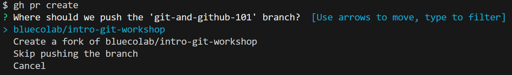

## Creating a pull request

**Important**: Please always create pull requests on Blue CoLab GitHub org. The base branch name should always contain the name Blue CoLab.

Also remember that once you create a PR you don't need to keep on creating new ones for the same branch. You can do a simple `git push` to sync your changes.

There are three ways to create a pull request:

### Via VS Code
Please follow: https://code.visualstudio.com/docs/sourcecontrol/github#_creating-pull-requests

### Via GH CLI
To create a new PR:
```
gh pr create
```

1. When it asks "Where should we push the '<new-branch-name>' branch? Select (by pressing Enter) the "bluecolab/<name-of-repo>' option. In this case the first one.

    

2. Next it will prompt you with the title, create a short name describing what you changed.
    
3. Optionally after entering the title, you can add details to the PR. Press 'E' and a new tab in VS Code should pop up. There enter what you changed then close the tab.
4. Finally the option to "Submit" should appear, if you'r ready, hit Enter.
5. A link to the PR on GitHub should appear.

### Via GitHub
Please follow this guidance: https://docs.github.com/en/pull-requests/collaborating-with-pull-requests/proposing-changes-to-your-work-with-pull-requests/creating-a-pull-request#creating-the-pull-request

## Merging a PR

Before merging, always make sure there will be no merge conflicts will the main branch.

Locally you can do that by:
```
git pull origin main
```

If that is done cleanly, that means there are no merge conflicts. You can do a:
```
git push
``

If you do have issues there's a few ways of doing so:
- In GitHub: https://docs.github.com/en/pull-requests/collaborating-with-pull-requests/addressing-merge-conflicts/resolving-a-merge-conflict-on-github
- In VS Code: https://www.youtube.com/watch?v=lz5OuKzvadQ

It's good practice to have someone [review your changes and approve](https://docs.github.com/en/pull-requests/collaborating-with-pull-requests/reviewing-changes-in-pull-requests/reviewing-proposed-changes-in-a-pull-request) the PR.

Finally to merge you changes see please see: https://docs.github.com/en/pull-requests/collaborating-with-pull-requests/incorporating-changes-from-a-pull-request/merging-a-pull-request